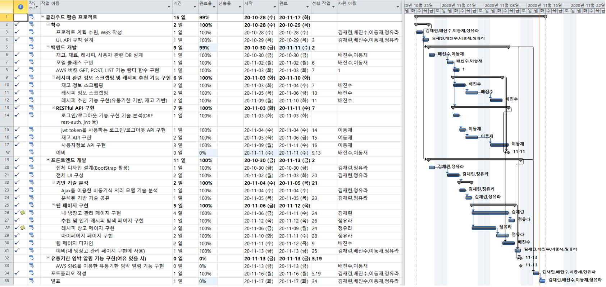

## Save your Ingredient

- *COVID-19* 상황으로 집에서 요리를 해먹는 빈도수가 많아짐

- 냉장고에서 버려지는 재료를 관리하고, 레시피를 추천해주는 사이트 제작

#### 개발 과정

##### 프로젝트 아키텍처

- 백엔드와 프론트엔드를 분리한 RESTful API 구조
- Backend
  - Requests, BeautifulSoup를 통한 데이터 크롤링 (만개의 레시피 사이트)
  - Django-REST-framework에 내장된 Serializer를 사용해 api 서버 구축
  - amazon-EC2
- Frontend
  - html, css, JS로 웹 사이트 구축
  - XMLHttpRequest를 통한 post, get 등의 json형식 데이터 활용
  - amazon S3 정적 웹 호스팅

##### WBS 활용

- 전체 업무를 전반적으로 이해하는데 도움을 줌

- 작업 단위별로 비교 및 측정에 용이

##### notion 활용

- 협업툴로 notion 활용

##### 플로우 차트

- ui 구성하기 전 플로우 차트를 작성해 기능 시각화

##### 카카오 오븐 (UI)

#### 개발환경

- Django-Rest-framwork, Amazon EC2, Amazon S3, Requests, Beautiful-Soup

- HTML, JS, CSS, jQuery

#### 웹 페이지

